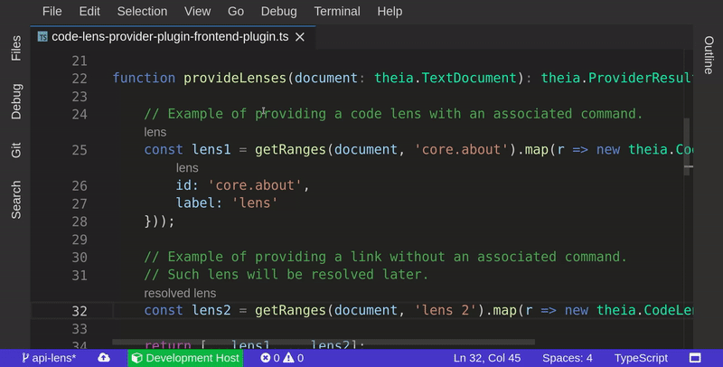

## code-lens-provider-plugin

Sample plugin which demonstrates the Code Lens Provider Plug-in API.

It shows how to register a [`CodeLensProvider`](https://github.com/theia-ide/theia/blob/master/packages/plugin/API.md#code-lens-provider)
in order to add a custom lens detection logic.

### Demo

The Plug-in contributes 2 types of lenses:
- with an associated command;
- without an associated command - such link will be resolved.

