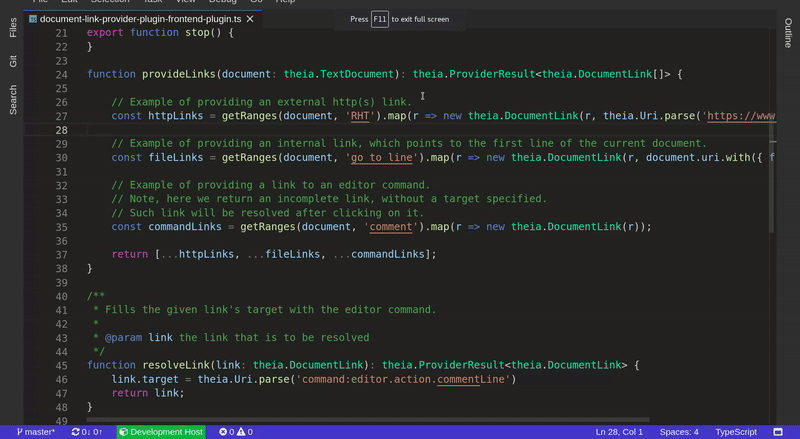

## document-link-provider-plugin

Sample plugin which demonstrates the Document Link Provider Plug-in API.

It shows how to register a [`DocumentLinkProvider`](https://github.com/theia-ide/theia/blob/master/packages/plugin/API.md#document-link-provider)
in order to add a custom link detection logic.

### Demo

The Plug-in contributes 3 types of links:
- detects `RHT` text as an external http(s) link;
- detects `go to line` text as an internal link to the 1'st line of the current document;
- detects `comment` text as a link for executing an editor command.

