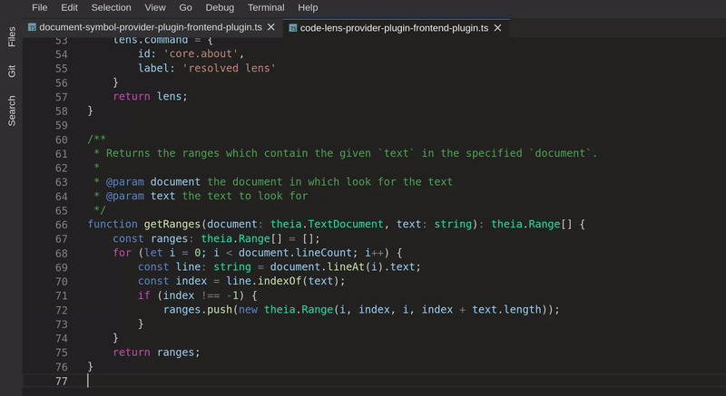

## document-symbol-provider-plugin

Sample plugin demonstrates the Document Symbol Provider Plug-in API.

It shows how to register a [`DocumentSymbolProvider`](https://github.com/theia-ide/theia/blob/master/packages/plugin/API.md#document-symbol-provider)
in order to add a custom logic for symbol detection.

### Demo

Contributes a document symbol that represents a plugin's entry point - the `start` function.

