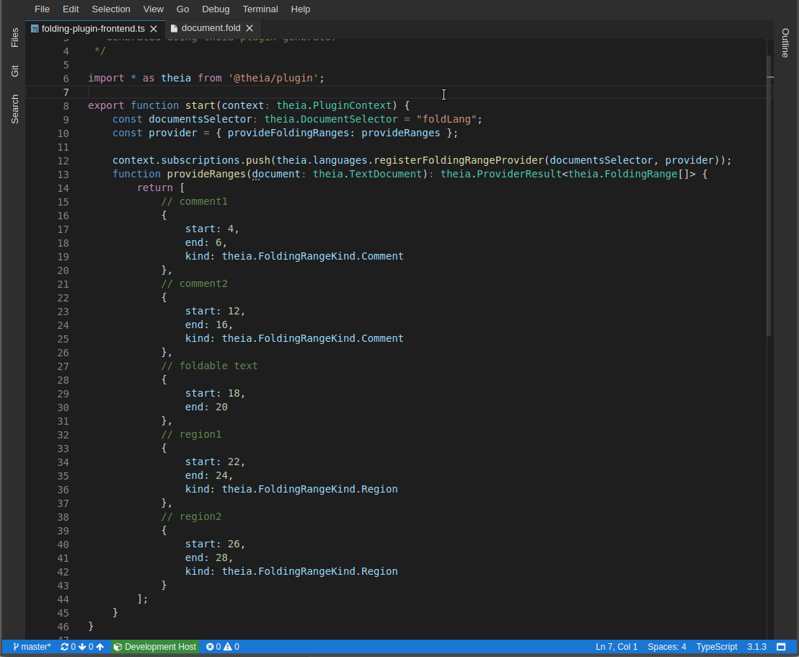

## folding-plugin

Sample plug-in which demonstrates the folding feature of languages plug-in API.

It contains example of how to register (`FoldingRangeProvider`)[https://github.com/theia-ide/theia/blob/master/packages/plugin/API.md#folding] in order to fold and unfold custom regions of source code.

### Demo

The plug-in contributes a custom language ID `foldLang` and defines several folding regions for `sample/document.fold`.

