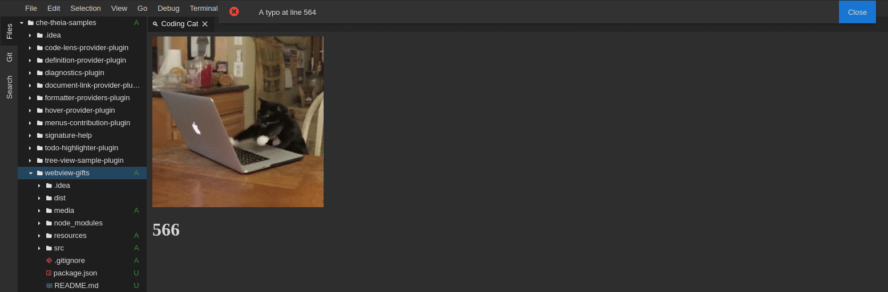

# Cat Coding — A Webview API Sample

Sample webview plugin which includes:

- Creating and showing a basic webview.
- Dynamically updating a webview's content.
- Loading local content in a webview.
- Loading local tab-icon which depends on the current theme.
- Running scripts in a webview.
- Sending message from an extension to a webview.
- Sending messages from a webview to an extension.
- Using a basic content security policy.

### Demo

